UNIVERSITÀ DEGLI STUDI DI TRENTO 
Dipartimento di Ingegneria e Scienza dell’Informazione

## Progetto: Cycle-Place
## Titolo del documento: Descrizione di Progetto

---

### Document Info 
**Doc. Name**: D1-cycle-place-DescrizioneProgetto 
**Doc. Number**: D1 v1.2 
**Description**: Documento di analisi dei requisiti funzionali, non funzionali, use case, user story e design front-end per l'applicazione Cycle-Place.

---

**INDICE**
1. Il progetto Cycle-Place
2. Requisiti Funzionali
3. Requisiti Non Funzionali
4. Use Case Diagram
5. User Story
6. Design Front-end

---

## 1. Il progetto Cycle Place 
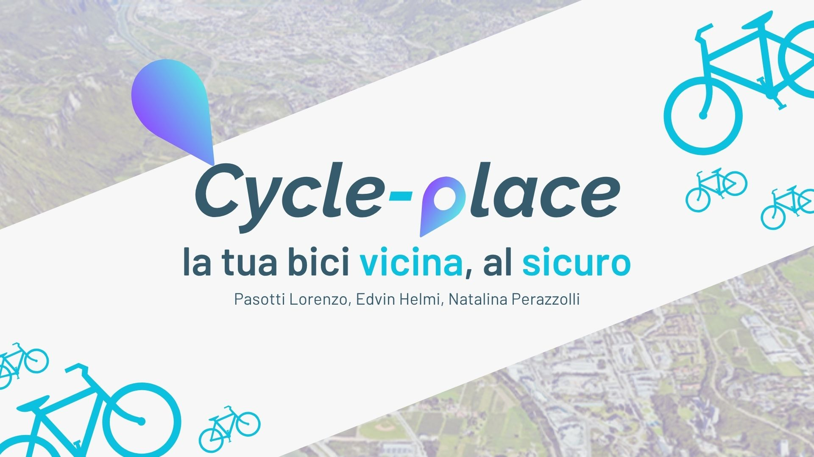
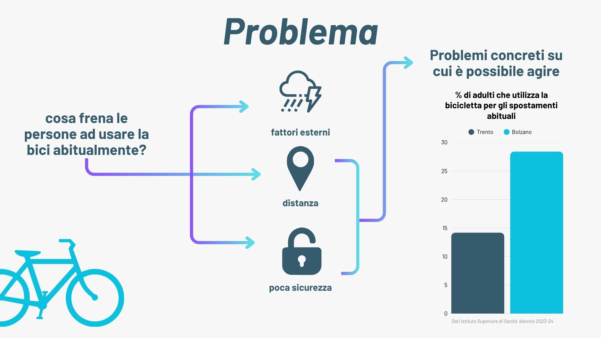
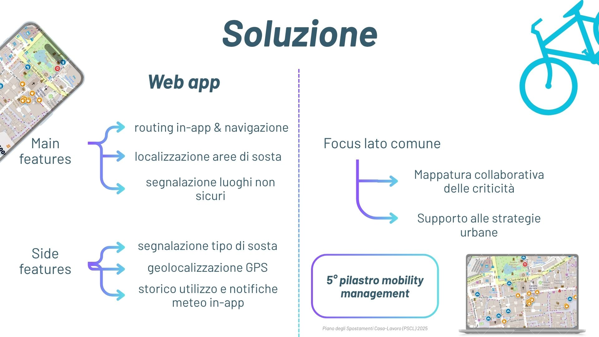
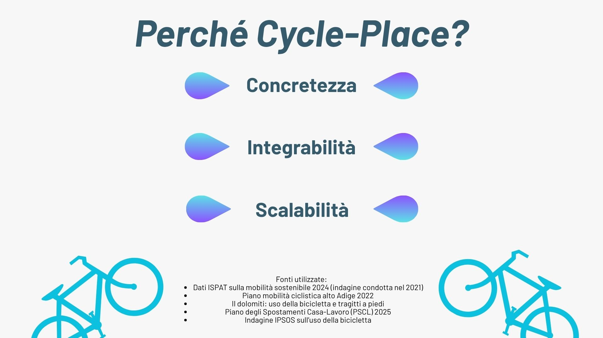

Il presente progetto mira ad affrontare la problematica della scarsa propensione degli individui all'utilizzo della bicicletta per gli spostamenti abituali, nonostante i numerosi benefici che il suo uso regolare può apportare alla salute ed il suo ruolo chiave nella promozione di una mobilità sostenibile. 
Attualmente, molti potenziali ciclisti rinunciano a spostarsi in bicicletta a causa di ostacoli esterni, come per esempio la mancanza di parcheggi sicuri e accessibili, il potenziale rischio di furto e una più generale carenza di infrastrutture dedicate, che contribuiscono a una percezione diffusa di insicurezza. 
Questa dinamica viene evidenziata dai dati pubblicati dall'Istituto Superiore della Sanità nel biennio 2023-2024 all'interno del progetto PASSI, dai quali emerge che, nonostante le città di Trento e Bolzano mostrino un uso superiore alla media nazionale, la percentuale di adulti che utilizza abitualmente la bicicletta rimane ancora limitata. Ulteriori riscontri emergono dai dati ISPAT sulla mobilità sostenibile, dal Piano mobilità ciclistica Alto Adige 2022 e dal Piano degli Spostamenti Casa-Lavoro (PSCL) 2025.
Il progetto ha come obiettivo la realizzazione di una web app, Cycle-Place, finalizzata a promuovere l'adozione quotidiana della bicicletta. L'applicazione si rivolge a tutti i cittadini, offrendo uno strumento semplice e immediato per pianificare la sosta ed interagire con la community. 

Le funzionalità principali dell'applicazione sono state definite per risolvere direttamente questi problemi e includono:
- Localizzazione su mappa delle aree di sosta, visualizzazione delle caratteristiche della sosta (tipologia, numero stalli, zona) e possibilità di filtrare per modello di rastrelliera (es. bloccatelaio vs tradizionale).
- Sistema Community-based (Preferiti e Segnalazioni): Gli utenti registrati possono salvare i propri parcheggi abituali e inviare segnalazioni (es. rastrelliera danneggiata, area insicura).
- Pianificazione Percorsi (Routing): Integrazione In-App con OpenRouteService per calcolare tragitti ciclabili o pedonali dalla posizione attuale al parcheggio scelto.
- Funzioni secondarie quali informazioni meteo per aiutare l'utente a pianificare il proprio tragitto.

### Vantaggi per il Comune:
- Supporto alla mobilità sostenibile: l'applicazione stimola l'uso quotidiano della bicicletta, contribuendo alla riduzione del traffico e delle emissioni inquinanti.
- Supporto alla pianificazione urbana: le segnalazioni degli utenti e i dati raccolti offrono informazioni sempre aggiornate per la progettazione di interventi infrastrutturali più efficaci, supportando strategie come il PSCL 2025.
- Economicità, integrabilità e scalabilità: si tratta di una soluzione a basso costo implementativo rispetto ad interventi fisici strutturali, progettata per integrarsi con i servizi esistenti.

### Vantaggi per gli utenti:
- Partecipazione attiva alla qualità del servizio: la possibilità di segnalare punti poco sicuri e tipologie di sosta consente di contribuire direttamente al miglioramento dell'esperienza ciclistica cittadina.
- Maggiore sicurezza: individuazione rapida di parcheggi sicuri e disponibilità di un canale immediato per la segnalazione dei problemi riscontrati.
- Esperienza d’uso intuitiva: un’interfaccia semplice e funzionalità mirate rendono l’app accessibile a tutti, promuovendo un utilizzo naturale e frequente.

### Limiti dell'applicazione:
- Partecipazione costante: la qualità delle mappe e delle segnalazioni dipende dalla partecipazione attiva della community, soprattutto nelle fasi iniziali.
- Copertura territoriale variabile: nelle aree meno frequentate o extraurbane, la disponibilità di dati potrebbe essere limitata.
- Requisiti tecnologici e connessione: l'app richiede uno smartphone e una connessione internet stabile, escludendo potenzialmente categorie di cittadini non digitalizzati.
- Richiede investimenti iniziali: sono necessari per lo sviluppo e la configurazione della piattaforma, l'acquisizione e validazione dei dati sulle aree di sosta, e per garantire l'integrazione con i sistemi informativi esistenti. A queste voci si aggiungono le attività di formazione del personale sull'utilizzo degli strumenti di gestione delle segnalazioni.

---

## 2. Requisiti Funzionali (RF)

### RF 1 - Gestione autenticazione
- **RF 1.1 - Accesso anonimo**: Il sistema deve permettere la visualizzazione della mappa interattiva delle aree di sosta (filtrabili per tipologia) e delle iniziative del comune senza richiedere autenticazione.
- **RF 1.2 - Registrazione**: Il sistema deve permettere la creazione di un account tramite email valida, nome, cognome e una password che soddisfi criteri di complessità. 
- **RF 1.3 - Accesso utente registrato**: Autenticazione tramite credenziali locali (email e password) o tramite credenziali Google (OAuth 2.0).
- **RF 1.4 - Flusso di autenticazione esterna**: Gestione del reindirizzamento al provider Google, validazione del token e creazione/associazione automatica del profilo.
- **RF 1.5 - Recupero password**: Funzionalità sicura per il recupero della password tramite link temporaneo via email.
- **RF 1.6 - Logout**: Disinclusione sicura della sessione attiva da qualsiasi dispositivo.
- **RF 1.7 - Gestione della sessione**: Mantenimento della sessione tramite token JWT con supporto per il refresh automatico.
- **RF 1.8 - Invalidazione della sessione**: Il logout o un nuovo login deve invalidare i Refresh Token precedenti, forzando la riautenticazione. 
- **RF 1.9 - Rate Limiting Autenticazione**: Il sistema deve limitare i tentativi di login consecutivi per prevenire attacchi brute-force. 

### RF 2 - Registrazione utente
- **RF 2.1 - Registrazione con credenziali locali** tramite form (Nome, Cognome, email valida, password composta da almeno 8 caratteri di cui almeno 1 numero, una lettera maiuscola ed un carattere speciale).
- **RF 2.2 - Registrazione tramite Google** con importazione automatica dei dati di base.

### RF 3 - Gestione profilo
- **RF 3.1 - Visualizzazione del profilo** (informazioni personali, rastrelliere salvate e segnalazioni effettuate).
- **RF 3.2 - Modifica delle informazioni personali** 
- **RF 3.3 - Modifica della password**.
- **RF 3.4 - Richiesta di cancellazione definitiva dell'account e dei dati associati** (GDPR).
- **RF 3.5 - Cancellazione definitiva del proprio account e di tutti i dati associati** (preferiti, segnalazioni).
- **RF 3.6 - Cancellazione rastrelliere preferite dal profilo**: L'utente registrato deve poter visualizzare l'elenco delle proprie rastrelliere o parcheggi preferiti all'interno della dashboard personale e decidere di rimuoverli in qualsiasi momento, sincronizzando la modifica in tempo reale con il database.

### RF 4 - Backup e Ripristino
Esecuzione di backup regolari dei dati critici per garantirne il ripristino in caso di guasti.

### RF 5 - Gestione mappa e aree di sosta
- **RF 5.1 - Visualizzazione mappa** centrata sulla posizione GPS dell'utente o sull'area selezionata.
- **RF 5.2 - Visualizzazione delle aree di sosta** distinte per tipologia (rastrelliera, Ciclobox).
- **RF 5.3 - Filtraggio delle aree di sosta per tipologia**.
- **RF 5.4 - Dettaglio area di sosta** tramite popup (tipologia (rastrelliera o ciclobox), numero di stalli, zona, informazioni sullo stato (solo per i Ciclobox), ad es: disponibile/non disponibile, presenza di segnalazioni effettuate da altri utenti).
- **RF 5.5 - Salvataggio e visualizzazione rapida delle aree di sosta preferite**.
- **RF 5.6 - Calcolo del percorso efficiente e sicuro tra due punti**: il sistema deve integrare In-App l'API di OpenRouteService per calcolare e visualizzare sulla mappa il percorso tra la posizione attuale dell'utente (se concessa) e l'area di sosta selezionata.
- **RF 5.7 - Sintesi vocale in-app**: Durante la navigazione Turn-by-Turn, il sistema deve integrare la Web Speech API per riprodurre automaticamente le istruzioni di guida a voce alta, supportando la localizzazione multilingua (Italiano, Inglese e Tedesco).

### RF 6 - Gestione storico utilizzo
Visualizzazione dello storico delle interazioni (segnalazioni inviate, aree salvate).

### RF 7 - Widget Meteo e Sistema di Allerta
- **RF 7.1 - Visualizzazione meteo live**: Il sistema deve integrare un widget nella barra di navigazione che mostra in tempo reale la temperatura e le condizioni atmosferiche correnti (tramite l'API Open-Meteo).
- **RF 7.2 - Banner di allerta meteo automatizzato**: Il sistema deve monitorare le condizioni meteorologiche e attivare automaticamente un banner fluttuante di allerta in-app in caso di eventi avversi (es. forti piogge, temporali, neve), informando l'utente prima di mettersi in marcia.

### RF 8 - Personalizzazione del Tema Grafico
- **RF 8.1 - Toggle Tema Chiaro/Scuro**: Il sistema deve permettere all'utente di alternare in qualsiasi momento il tema visivo dell'interfaccia tra la modalità chiara di default e la modalità scura (dark), salvando la preferenza nel localStorage del browser.

### RF 9 - Scelta della lingua
Il sistema deve permettere all'utente di scegliere in quale lingua fruire dell'applicazioni. Sono disponibili il supporto per italiano, inglese e tedesco.

---

## 3. Requisiti Non Funzionali (RNF)

### RNF 1 - Perfomance
- **RNF 1.1 - Velocità della mappa**: Il caricamento ed il rendering della mappa interattiva deve essere completato entro un massimo di 2 secondi, anche con una connessione mobile media (3G/4G). Nota: le performance dipendono anche dai tempi di risposta dell'API OpenStreetMap.
- **RNF 1.2 Latenza di routing**: Il calcolo del percorso ottimizzato per bici (RF 4) tramite OpenRouteService non deve superare i 5 secondi di elaborazione server, per garantire la fruibilità in movimento.
- **RNF 1.3 - Tempi di risposta API**: Le chiamate alle API del backend (caricamento dati GeoJSON, invio di una segnalazione o richiesta di login) devono completarsi con successo entro 500 millisecondi con un carico medio.
- **RNF 1.4 - Gestione connessione intermittente**: L'applicazione mobile deve mantenere le funzionalità di base (es. visualizzazione di mappe cache o dati dei parcheggi già caricati) anche in assenza temporanea di connessione Internet.
- **RNF 1.5 - Ottimizzazione del rendering cartografico**: Per garantire fluidità a 60fps e ridurre il carico sul DOM durante lo scorrimento della mappa con centinaia di punti, il sistema deve sfruttare il rendering basato su canvas (preferCanvas: true) e disattivare temporaneamente gli eventi mouse sui marker durante il movimento.

### RNF 2 - Sicurezza e crittografia
- **RNF 2.1 - Autenticazione e Autorizzazione**: Le comunicazioni tra l'app ed il server devono essere crittografate tramite protocolli TLS/SSL (HTTPS). Solo gli utenti autenticati e registrati (verificati tramite JWT) devono essere autorizzati ad inviare segnalazioni e ad accedere allo storico personale.
- **RNF 2.2 - Protezione dati**: Le password degli utenti devono essere archiviate nel database locale tramite hashing sicuro (utilizzando l'algoritmo bcrypt).
- **RNF 2.3 - Protezione dati di geolocalizzazione**: I dati di geolocalizzazione necessari per il routing devono essere trattati nel rispetto della privacy e non memorizzati in modo persistente se non strettamente necessario per le segnalazioni inviate esplicitamente dall'utente.
- **RNF 2.4 - Validazione input e Affidabilità**: Il sistema deve implementare una precisa validazione di tutti gli input utente (form di registrazione, segnalazioni) per prevenire attacchi comuni e implementare rate limiting per limitare lo spam di segnalazioni.
- **RNF 2.5 - Rate Limiting delle API**: Il sistema deve implementare limitazioni di frequenza (express-rate-limit) sugli endpoint critici, come le richieste di autenticazione e l'invio di segnalazioni, per prevenire abusi, attacchi brute-force e spam da parte degli utenti.

### RNF 3 - Usabilità
- **RNF 3.1 - Design coerente e Reattività**: L'interfaccia utente (UI) deve seguire le linee guida di design moderne (Material Design/Human Interface Guidelines) e rispondere ai gesti touch in modo istantaneo. Il processo di invio di una segnalazione deve essere rapido e intuitivo.

### RNF 4 - Affidabilità e Disponibilità
- **RNF 4.1 - Disponibilità del servizio**: Il back-end e l'API devono garantire un tempo di attività (uptime) pari al 99.5% su base mensile (esclusi gli slot di manutenzione programmati).
- **RNF 4.2 - Durata della sessione**: Dopo il login, l'utente autenticato deve rimanere connesso per un periodo di tempo esteso (30 giorni, gestito tramite Refresh Token JWT), richiedendo un nuovo login solo in caso di logout esplicito o scadenza prolungata.

### RNF 5 - Manutenibilità e Portabilità
- **RNF 5.1 -Modularità, Logging e Standard dei dati**: Il codice sorgente del back-end deve essere strutturato in modo modulare. Il sistema deve implementare un logging degli errori e tutti i dati delle aree di sosta e delle segnalazioni devono essere scambiati nel formato standard GeoJSON.

---

## 4. Use Case Diagram ***************************************** AGGIUNGERE

---

## 5. User Stories

#### User Story 1 – Associata a RF 1.1 / RF 5.3: Accesso anonimo e filtri mappa
Visualizzazione della mappa interattiva, filtraggio delle aree di sosta e consultazione delle iniziative senza autenticazione. 
Come utente non registrato, voglio poter visualizzare la mappa interattiva, filtrare le aree di sosta per tipologia ed effettuare ricerche, in modo da poter consultare le informazioni di base senza dover effettuare l'accesso. 

Criteri di Accettazione:
- La mappa carica i dati delle aree di sosta entro 2 secondi (RNF 1.1) prima di ogni autenticazione.
- La funzionalità di filtraggio delle aree per tipologia (es. rastrelliere e Ciclobox) è attiva anche in modalità anonima.
- I marker delle aree di sosta sulla mappa sono visibili e interattivi.

TASKS – User Story 1:
- Sviluppare la logica di caricamento dati cartografici per utenti anonimi.
- Implementare i filtri mappa base sul lato client per l'accesso non autenticato.
- Testare la visualizzazione dei contenuti pubblici.

#### User Story 2 – Associata a RF 1.2 / RF 2.1 / RF 2.2: Registrazione utente
Creazione autonoma di un nuovo account. 
Come nuovo utente, voglio potermi registrare fornendo i miei dati e un indirizzo email valido con una password sicura, in modo da poter accedere alle funzionalità riservate della community. 

Criteri di Accettazione:
- Il form di registrazione richiede Nome, Cognome, email valida e una password conforme ai requisiti di complessità (min 8 caratteri, 1 maiuscola, 1 numero, 1 carattere speciale).
- Il sistema verifica l'unicità dell'email e restituisce errori descrittivi in caso di campi non validi.
- È possibile completare la registrazione in alternativa tramite autenticazione Google con importazione automatica dei dati di base.

TASKS – User Story 3:
- Sviluppare la UI del form di registrazione e la validazione real-time degli input lato client.
- Implementare l'endpoint di backend per la creazione protetta dell'account con hashing bcrypt della password.
- Testare il flusso completo di registrazione locale e tramite Google SSO.

#### User Story 3 – Associata a RF 1.3 / RF 1.4: Login utente e sessione
Scelta tra credenziali locali o autenticazione Google. 
Come utente, voglio potermi autenticare con credenziali locali o tramite l'account Google, in modo da poter accedere nel modo che preferisco e con una gestione sicura della sessione. 

Criteri di Accettazione:
- Il form di login offre la scelta tra le credenziali locali e il pulsante di autenticazione "Accedi con Google".
- Tutte le comunicazioni di autenticazione sono crittografate tramite HTTPS (RNF 2.1).
- La sessione è mantenuta attiva tramite token JWT con supporto per il refresh automatico (RF 1.7).

TASKS – User Story 2:
- Sviluppare la logica di gestione dei token JWT (emissione e refresh automatico).
- Integrare il protocollo OAuth 2.0 per il servizio di autenticazione Google.
- Testare la gestione della sessione persistente.

#### User Story 4 – Associata a RF 1.5 / RF 1.6 / RF 1.8: Recupero password e logout
Ripristino sicuro delle credenziali e disconnessione. 
Come utente, voglio ricevere un link sicuro per reimpostare la mia password in caso di smarrimento e potermi disconnettere in modo sicuro, in modo da proteggere il mio account da qualsiasi dispositivo. 

Criteri di Accettazione:
- La richiesta di recupero password invia un link temporaneo all'indirizzo email registrato.
- L'azione di logout revoca la sessione attiva e invalida i token associati.
- Il processo di aggiornamento della password utilizza un hashing sicuro (RNF 2.2).

TASKS – User Story 4:
- Sviluppare il servizio di invio email e gestione del token di reimpostazione.
- Implementare l'endpoint di logout che pulisce i token locali e di sessione.
- Testare la disconnessione sicura e l'invalidazione dei token.

#### User Story 5 – Associata a RF 2.3: Selezione lingua e preferenze
Personalizzazione della lingua dell'interfaccia. 
Come utente, voglio poter selezionare la lingua dell'interfaccia scegliendo tra italiano, inglese e tedesco, in modo da utilizzare l'app secondo le mie preferenze linguistiche. 

Criteri di Accettazione:
- Il sistema supporta la selezione dinamica e la visualizzazione immediata dell'interfaccia in italiano, inglese e tedesco.
- La preferenza della lingua viene memorizzata localmente per le sessioni successive.

TASKS – User Story 5:
- Implementare il framework di internazionalizzazione (i18n) con file JSON dedicati per le tre lingue.
- Sviluppare la UI per il selettore della lingua persistente tramite localStorage.

#### User Story 6 – Associata a RF 3.1 / RF 3.2 / RF 3.3: Gestione profilo e aggiornamento credenziali
Visualizzazione dei dati personali e modifica delle impostazioni. 
Come utente registrato, voglio poter visualizzare il mio profilo e modificare le mie informazioni personali o la password, in modo da mantenere i dati aggiornati e sicuri. 

Criteri di Accettazione:
- La dashboard personale mostra le informazioni anagrafiche e le preferenze dell'utente.
- È disponibile una sezione dedicata alla modifica della password e dei dati personali.

TASKS – User Story 6:
- Creare la UI della dashboard personale per la gestione dei dati anagrafici.
- Sviluppare gli endpoint API per l'aggiornamento sicuro del profilo e della password.

#### User Story 7 – Associata a RF 3.4 / RF 3.5: Cancellazione account (GDPR)
Rimozione definitiva dei dati personali. 
Come utente registrato, voglio richiedere la cancellazione definitiva del mio account e dei dati associati, in modo da esercitare i miei diritti sulla privacy (GDPR). 

Criteri di Accettazione:
- L'utente può avviare la procedura di eliminazione account tramite un'apposita opzione nel profilo.
- Il sistema richiede una conferma esplicita prima di procedere alla rimozione irreversibile di preferiti e segnalazioni dal database.

TASKS – User Story 7:
- Sviluppare l'endpoint API e il modale di conferma per la cancellazione definitiva dell'account.
- Testare la corretta rimozione a cascata dei dati correlati all'utente nel database.

#### User Story 8 – Associata a RF 5.1 / RF 5.4: Visualizzazione mappa e geolocalizzazione GPS
Mappa interattiva e individuazione della posizione corrente. 
Come utente, voglio vedere la mappa, che può essere centrata sulla mia posizione tramite GPS e visualizzare i dettagli completi delle rastrelliere e dei parcheggi protetti, in modo da trovare il punto di sosta più vicino a me. 

Criteri di Accettazione:
- La mappa si centra sulla posizione GPS rilevata del dispositivo tramite il pulsante "La mia posizione".
- Selezionando un marker sulla mappa, si apre un popup con i dettagli specifici (tipo, stalli liberi/occupati, numero di stalli, zona).

TASKS – User Story 8:
- Implementare le API di geolocalizzazione HTML5 per il tracciamento della posizione utente.
- Sviluppare i popup dinamici di dettaglio per rastrelliere tradizionali, bloccatelaio e parcheggi protetti.

#### User Story 9 – Associata a RF 5.6: Calcolo del percorso e Routing In-App
Pianificazione del tragitto ciclabile o a piedi. 
Come utente, voglio calcolare il percorso tra la mia posizione e una destinazione selezionata, in modo da visualizzare le indicazioni stradali in tempo reale. 

Criteri di Accettazione:
- Il sistema calcola il percorso ottimizzato scegliendo tra il profilo in bici o a piedi.
- L'interfaccia mostra la distanza, il tempo stimato di percorrenza e le indicazioni in-app.

TASKS – User Story 9:
- Integrare il servizio di routing OpenRouteService per il calcolo dei percorsi.
- Sviluppare il pannello di navigazione in-app con indicazioni e statistiche di viaggio.

#### User Story 10 – Associata a RF 5.5: Salvataggio preferiti
Gestione rapida delle rastrelliere preferite. 
Come utente registrato, voglio salvare una rastrelliera o un parcheggio tra i miei preferiti, in modo da poterli ritrovare rapidamente nella dashboard personale. 

Criteri di Accettazione:
- È presente un pulsante interattivo (icona a forma di cuore) all'interno del popup di dettaglio per aggiungere o rimuovere il preferito.
- I preferiti salvati vengono sincronizzati nel database e sono consultabili nell'area personale.

TASKS – User Story 10:
- Sviluppare gli endpoint API per il salvataggio e la rimozione dei preferiti utente.
- Configurare l'aggiornamento visivo immediato dei marker a forma di cuore sulla mappa.

#### User Story 11 – Associata a RF 3.6 / RF 5.5: Rimozione rastrelliere preferite
Gestione e rimozione dei preferiti salvati dall'area personale. 
Come utente registrato, voglio poter rimuovere una rastrelliera o un parcheggio dai miei preferiti direttamente dal mio profilo, in modo da mantenere aggiornato l'elenco dei luoghi di mio interesse. 

Criteri di Accettazione:
- Nella dashboard personale è presente un pulsante di rimozione associato a ciascun preferito salvato.
- Cliccando sul pulsante, il luogo viene rimosso istantaneamente sia dall'elenco della dashboard che dallo stato attivo sulla mappa.

TASKS – User Story 11:
- Sviluppare l'endpoint API DELETE per la rimozione dei preferiti dal profilo utente.
- Aggiornare la UI della dashboard per consentire la cancellazione rapida dei preferiti salvati.
- Sincronizzare lo stato visivo dei marker a cuore sulla mappa in seguito alla rimozione.

#### User Story 12 – Associata a RF 6: Modulo segnalazione guasti e problemi
Invio di segnalazioni sulla mappa. 
Come utente registrato, voglio poter inviare una segnalazione in corrispondenza di una rastrelliera o di un parcheggio, in modo da avvisare su problemi riscontrati. 

Criteri di Accettazione:
- L'accesso al modulo di segnalazione richiede l'autenticazione valida dell'utente.
- Il modulo permette di selezionare le tipologie di problematica riscontrata e inserire note descrittive.

TASKS – User Story 12:
- Sviluppare la UI del modale di segnalazione collegato alle coordinate della rastrelliera.
- Sviluppare l'endpoint API per la memorizzazione delle segnalazioni nel sistema.

#### User Story 13 – Associata a RF 7: Gestione avvisi e allerte meteo in-app
Ricezione di allerte meteorologiche critiche. 
Come utente, voglio visualizzare un banner di allerta in-app quando sono previste condizioni meteorologiche avverse, in modo da poter valutare percorsi alternativi o guidare con maggiore prudenza. 

Criteri di Accettazione:
- Il sistema interroga i dati meteo in tempo reale e attiva un banner fluttuante centrato a cavallo tra la navbar e la mappa in caso di allerte severe.
- Il banner include icone di avviso e il testo localizzato nella lingua selezionata dall'utente, con la possibilità di chiuderlo manualmente tramite l'apposita "X", impedendone la ricomparsa fino alla chiusura della sessione del browser.

TASKS – User Story 13:
- Integrare il client meteo asincrono e la logica di controllo codici di allerta severa.
- Sviluppare la componente grafica del banner in-app e la gestione dinamica del posizionamento UI correlato.

---

## 6. Design Front-end

In questo capitolo vengono presentati i mockup delle schermate principali dell'applicazione Cycle Place, illustrando come l'interfaccia si presenta all'utente finale. Ciascuna interfaccia è associata ai relativi requisiti funzionali (RF) e non funzionali (RNF) definiti nei capitoli precedenti, accompagnata da una descrizione testuale per chiarire gli elementi chiave dell'UX/UI.

### 1. Schermata Principale e Mappa Interattiva

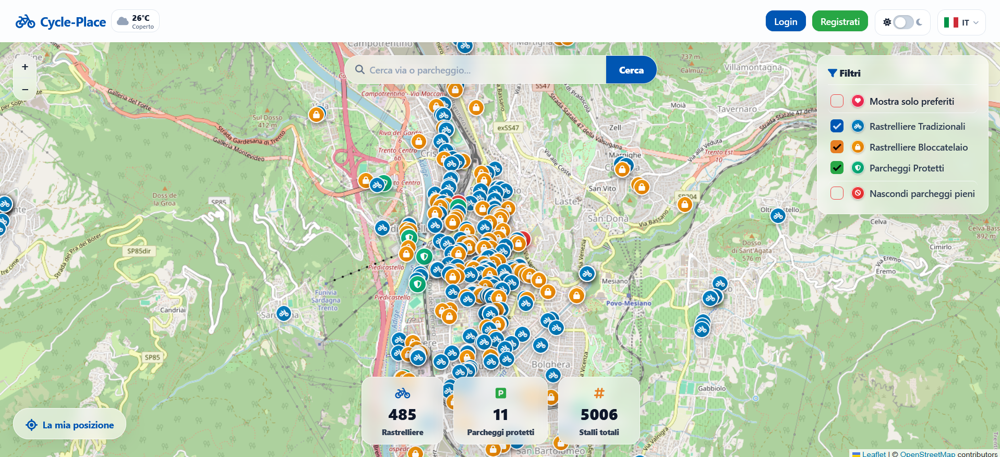

La schermata principale rappresenta il cuore della Web App ed è progettata per offrire un accesso immediato a tutti i servizi cartografici e di mobilità sostenibile del Comune di Trento.
- **RF 5.1 & RF 5.2 (Visualizzazione mappa e aree di sosta)**: L'interfaccia è occupata per la quasi totalità dallo spazio cartografico interattivo gestito tramite Leaflet.js e OpenStreetMap. Sulla mappa vengono renderizzati i marker geolocalizzati delle rastrelliere tradizionali, delle rastrelliere bloccatelaio e dei parcheggi protetti (Ciclobox).
- **RF 7 (Gestione avvisi e allerte meteo in-app)**: Nella barra di navigazione superiore, accanto al logo, è integrato un widget meteo in tempo reale (fornito da Open-Meteo) che mostra temperatura e condizioni atmosferiche correnti. In caso di condizioni meteorologiche avverse, compare dinamicamente un banner d'allerta fluttuante posizionato tra la navbar e la barra di ricerca, dotato di pulsante di chiusura manuale (x), come mostrato qui:

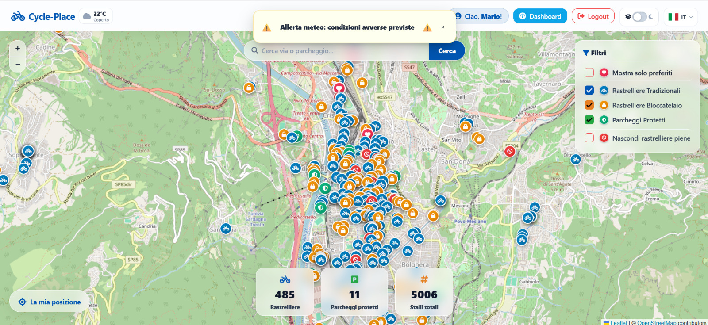

- **RF 5.1 (Barra di ricerca spaziale e geocoding)**: In alto al centro della mappa è posizionata una barra di ricerca che consente di cercare indirizzi o punti di interesse nel territorio, avviando automaticamente una geolocalizzazione e un filtraggio spaziale nel raggio di 200 metri nel caso in cui non venissero rilevati parcheggi nella via specificata.

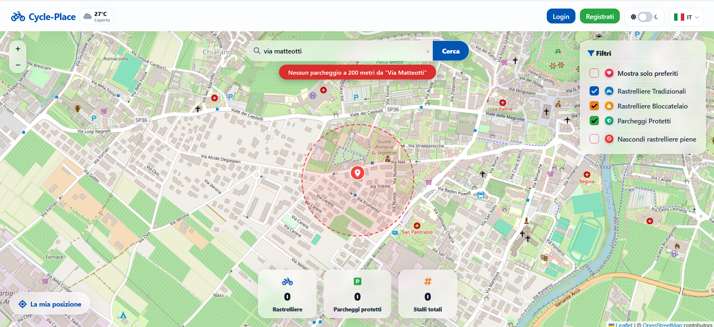
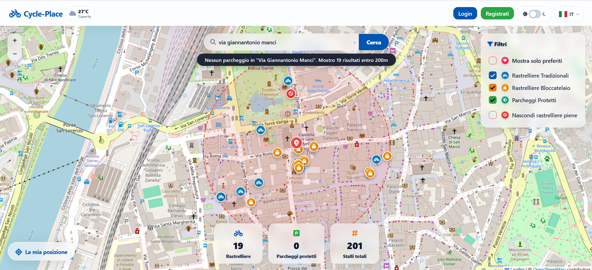

- **RF 5.3 (Filtri mappa e legenda)**: Sulla destra della mappa si trova il pannello dei filtri (accessibile anche da mobile tramite drawer responsive) che consente di filtrare le tipologie di sosta, nascondere le rastrelliere piene o visualizzare esclusivamente i preferiti salvati, con relativa legenda descrittiva dei pin.
- **RNF 1.1 (Velocità della mappa) & RNF 3.1 (Design e Reattività)**: L'utilizzo del rendering su canvas (preferCanvas: true) assicura una fluidità elevata anche durante lo scorrimento e lo zoom su centinaia di punti, offrendo un'esperienza touch reattiva e coerente.
- **RF 9 (Selezione lingua)**: Nell'header è integrato un selettore di lingua interattivo che permette all'utente di passare istantaneamente tra Italiano (IT), Inglese (EN) e Tedesco (DE), aggiornando in tempo reale tutti i testi dell'interfaccia e la guida vocale TTS.
- **Tema Chiaro/Scuro (UI Styling) (RF 8)**: Nell'header è presente un interruttore (toggle switch) che consente all'utente di cambiare istantaneamente il tema grafico dell'applicazione tra la modalità chiara di default e la modalità scura. La preferenza viene memorizzata localmente nel browser, garantendo continuità visiva tra le sessioni. Riportiamo anche la modalità scura come esempio:

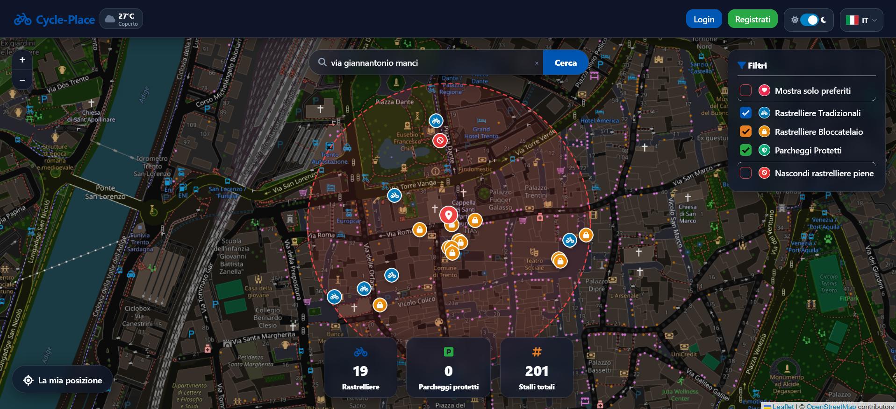

- **Responsive Design e Menu Hamburger (RNF 3.1)**: L'interfaccia adotta un layout completamente adattivo. Sui dispositivi mobili, i controlli utente, i filtri cartografici e la legenda si riorganizzano tramite un menu a comparsa azionato da un pulsante hamburger dedicato, garantendo un'esperienza d'uso fluida anche su schermi di ridotte dimensioni.

### 2. Modale di Autenticazione (Login & Registrazione)

La schermata di autenticazione è pensata per essere pratica e veloce: si apre direttamente sopra la mappa con un pannello a comparsa, pensata così per non interrompere l'esperienza di navigazione cartografica dell'utente.

- **RF 1.3 & RF 1.4 (Accesso utente e OAuth 2.0)**: Cliccando sul pulsante "Login" nella navbar, si apre una schermata centrata che offre la doppia opzione: l'inserimento delle credenziali locali (email e password) oppure l'accesso rapido e sicuro tramite il pulsante ufficiale Google SSO.

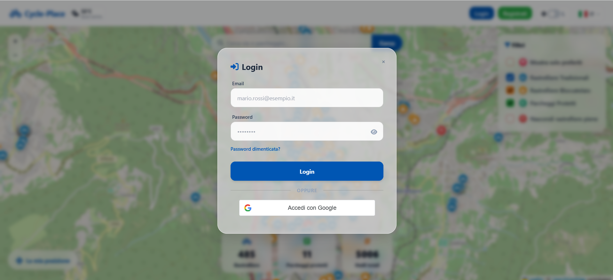

- **RF 1.5 & RF 2.1 (Recupero password e Registrazione)**: Dalla stessa area è possibile accedere al flusso di recupero password tramite link temporaneo via email o aprire il modale di registrazione (richiedendo Nome, Cognome, email valida e password conforme ai criteri di complessità).

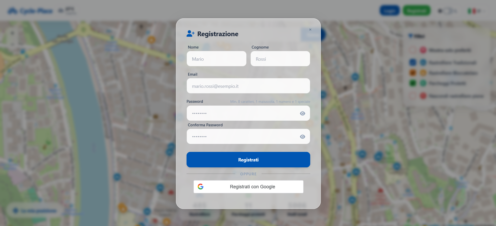

# MANCA SCHERMATA RECUPERO PASSWORD ************************************************************************

- **RNF 2.1 & RNF 2.2 (Sicurezza)**: Le modali implementano una rigida validazione lato client e si appoggiano a comunicazioni protette via HTTPS, crittografia delle password con bcrypt e meccanismi di Rate Limiting sul backend per prevenire attacchi brute-force.

### 3. Navigazione Turn-by-Turn in-app (Routing)

Quando l'utente seleziona una rastrelliera o un parcheggio dalla mappa e richiede le indicazioni stradali, l'applicazione attiva il modulo di navigazione assistita.

- **RF 5.6 (Calcolo del percorso efficiente e sicuro)**: Sfruttando l'integrazione con l'API di OpenRouteService, il sistema calcola la rotta ottimale scegliendo tra il profilo ciclabile o pedonale.

# MANCA SCHERMATA ******************************************************

- **Banner Turn-by-Turn e Guida Vocale (TTS) (RF 5.7)**: Durante la navigazione attiva, compare in alto un banner scuro che indica la distanza residua alla prossima manovra, l'icona direzionale e il testo dell'istruzione. Grazie alla Web Speech API, l'applicazione pronuncia automaticamente le indicazioni a voce nella lingua selezionata dall'utente.
- **Funzionalità di controllo**: L'interfaccia gestisce i pulsanti per recentrare la mappa sulla posizione GPS corrente, disattivare o attivare l'audio e terminare la sessione di navigazione in qualsiasi momento.

### 4. Popup Interattivi delle Aree di Sosta

Cliccando su un qualsiasi marker sulla mappa si attiva un popup strutturato in stile Glassmorphism che adatta i suoi contenuti in base alla tipologia di stallo selezionata.

- **RF 5.4 (Dettaglio area di sosta)**: Per le rastrelliere tradizionali e i parcheggi protetti vengono mostrati i dati anagrafici, il modello, il numero di stalli e la zona. Per i Ciclobox (Bloccatelaio), il popup integra una sezione di telemetria IoT in tempo reale con una progress bar dinamica e il conteggio esatto dei posti liberi e occupati.

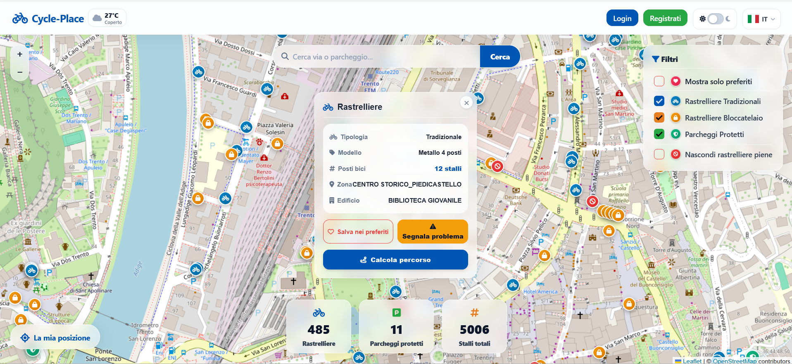
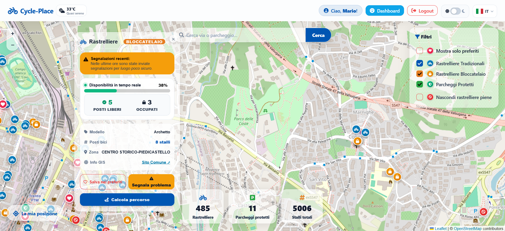

- **RF 3.6 & RF 5.5 (Gestione Preferiti)**: Il popup include un pulsante interattivo con l'icona di un cuore per aggiungere o rimuovere il luogo dai preferiti personali con un singolo click, aggiornando istantaneamente l'aspetto grafico del pin sulla mappa.
- **RF 6 (Segnalazione guasti e problemi)**: È presente un pulsante d'allerta che apre un modale per l'invio di segnalazioni (es. danni strutturali, atti di vandalismo, luoghi non sicuri). Qualora siano presenti segnalazioni recenti per quello stallo, il popup mostra automaticamente un avviso in evidenza.

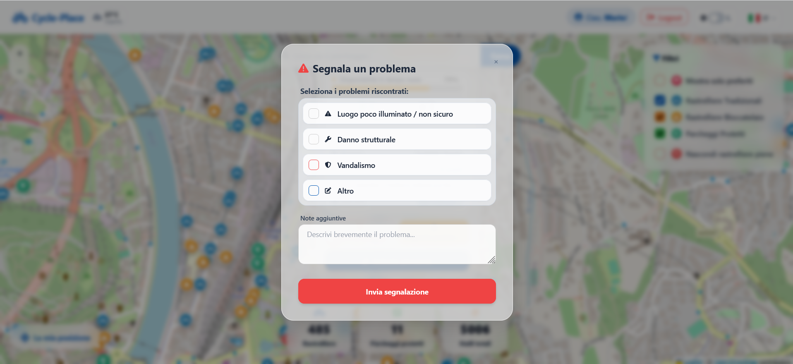

### 5. Dashboard Personale (Area Riservata)

La dashboard è un'area protetta e accessibile unicamente agli utenti autenticati, strutturata come un pannello di controllo completo per la gestione del profilo e delle preferenze.

- **RF 3.1 & RF 3.2 (Visualizzazione e modifica profilo)**: L'utente può visualizzare i propri dati anagrafici, il provider di accesso (Locale o Google) e modificare le proprie informazioni personali o la password tramite un form dedicato con controlli di sicurezza.
- **RF 3.6 & RF 5.5 (Storico Rastrelliere Preferite)**: Una sezione dedicata elenca tutte le rastrelliere e i parcheggi salvati nei preferiti, consentendo all'utente di consultarli o di rimuoverli rapidamente sincronizzando la modifica in tempo reale con il database.
- **RF 6 (Storico Segnalazioni)**: Mostra l'elenco cronologico di tutte le segnalazioni inviate dall'utente, evidenziandone lo stato di lavorazione corrente.
- **RF 3.4 & RF 3.5 (Cancellazione Account)**: In conformità con le normative sulla privacy, è presente una sezione di sicurezza con richiesta di conferma esplicita per la cancellazione definitiva e irreversibile del profilo e di tutti i dati correlati.

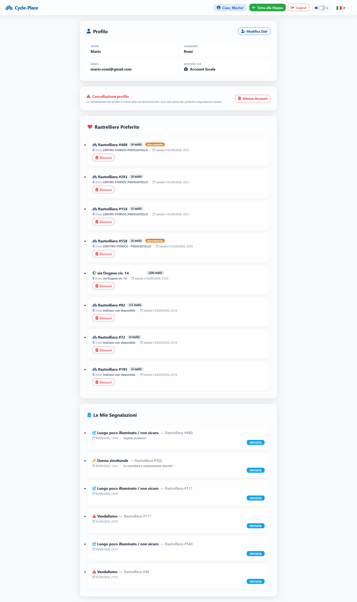
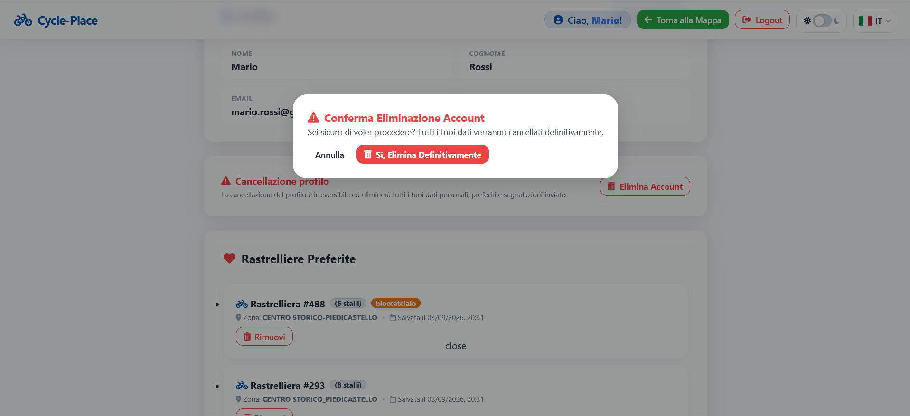

---

## 7. User Flow

### Flusso 1: Ricerca, geolocalizzazione e routing verso lo stallo
1. **Avvio:** L'utente apre l'applicazione via browser. La mappa si carica, i pin vengono renderizzati.
2. **Posizionamento GPS:** L'utente, per focalizzare il contesto circostante, preme il bottone GPS situato in basso a sinistra. Il browser richiede i permessi; se accordati, la mappa si centra sull'utente.
3. **Restrizione Visiva:** L'utente estende il menu a tendina "Filtri" e deseleziona le rastrelliere tradizionali per focalizzarsi sui "Parcheggi protetti".
4. **Ricerca Cartografica:** Notando uno stallo di interesse a qualche isolato di distanza, vi clicca/tocca sopra.
5. **Apertura Metadati:** Si attiva l'evento: la mappa esegue un pan (micro-spostamento animato) per inquadrare bene il popup che emerge sullo schermo.
6. **Routing In-App:** L'utente consulta il numero di posti e, soddisfatto, esegue il tap sul bottone interno per avviare il calcolo del percorso guidato.
7. **Conclusione:** Il sistema mostra a schermo la polilinea del tragitto e le indicazioni turn-by-turn per raggiungere lo stallo in bicicletta o a piedi.

### Flusso 2: Autenticazione e visualizzazione Dashboard
1. **Avvio:** L'utente accede all'app e intende controllare il proprio profilo.
2. **Accesso form:** L'utente identifica la Navbar e preme il pulsante "Login". 
3. **Interazione modale:** Un layer semi-trasparente sfuoca la mappa di background, ed emerge al centro un box di autenticazione ibrida.
4. **Inserimento:** L'utente digita "email" e "password" classiche nel form formattato ad-hoc, per poi inviare il *submit*.
5. **Validazione:** Il backend verifica la conformità del payload.
6. **Cambio di Stato UI:** L'esito è positivo. Il modale di login collassa. In modo invisibile la navbar effettua il binding reattivo e nasconde il bottone di Login/Registrazione, sostituendoli con un nuovo pulsante "Dashboard" e il saluto ("Ciao, Utente").
7. **Conclusione:** L'utente clicca su "Dashboard" venendo reindirizzato alla gestione del profilo, ove godrà dei pieni privilegi del suo ruolo, inclusa la gestione dei preferiti e delle segnalazioni.

### Flusso 3: Salvataggio preferiti e invio segnalazione
1. **Avvio:** L'utente autenticato naviga sulla mappa ed individua una rastrelliera di riferimento abituale.
2. **Interazione pin:** Clicca sul marker aprendo il popup descrittivo in stile Glassmorphism.
3. **Aggiunta preferiti:** L'utente preme l'icona a forma di cuore; il sistema registra istantaneamente lo stallo tra i preferiti sincronizzandolo con il database e aggiornando la grafica del pin.
4. **Segnalazione criticità:** Accedendo allo stesso popup, l'utente nota un danno strutturale e clicca su "Segnala problema".
5. **Compilazione form:** Si apre il modulo di segnalazione in cui seleziona il tipo di problematica e inserisce una breve nota descrittiva.
6. **Conclusione:** All'invio, la segnalazione viene memorizzata nel sistema per il supporto alla mobilità e l'avviso della community.
