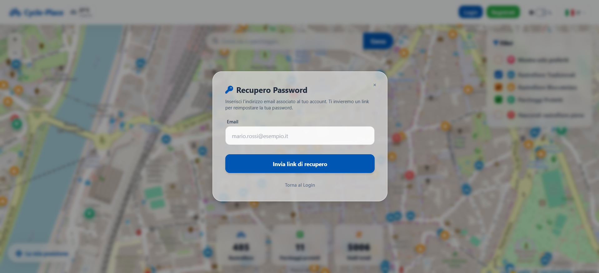
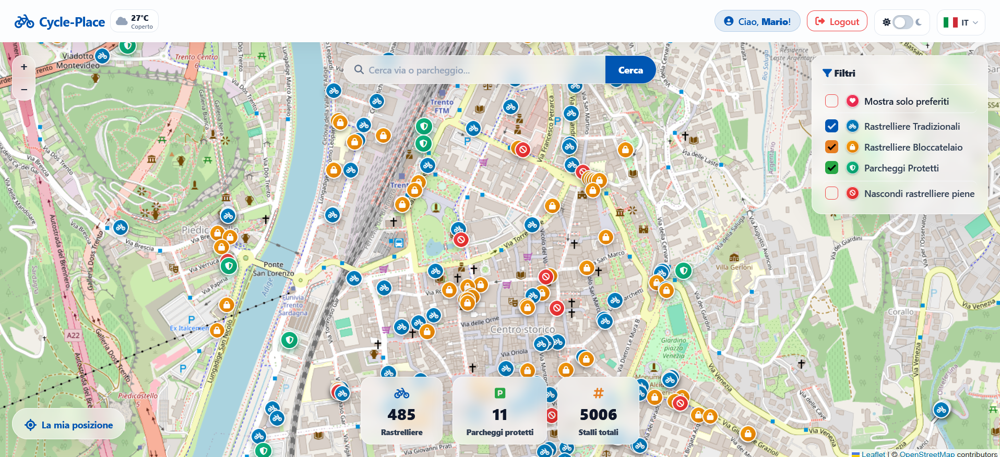
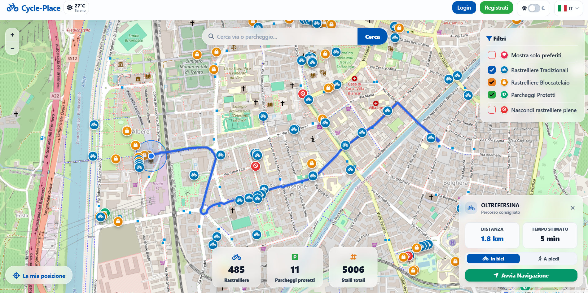
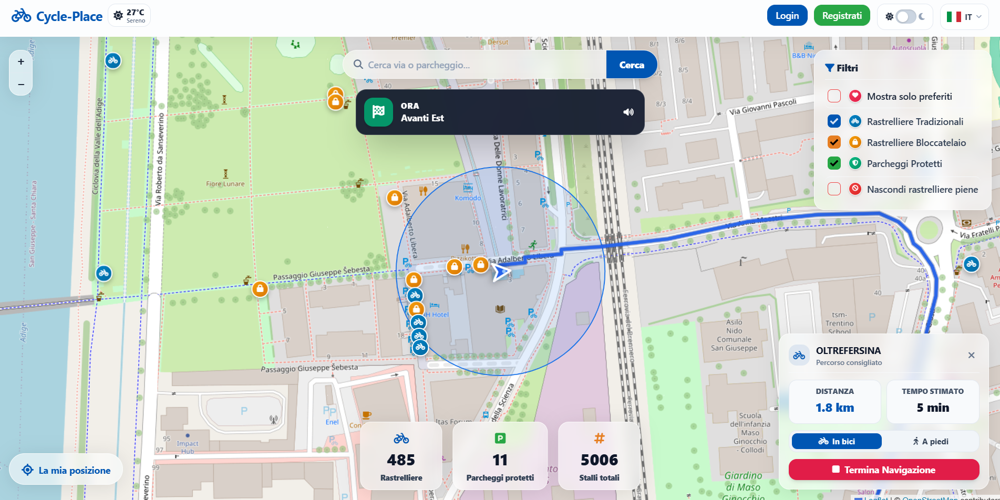
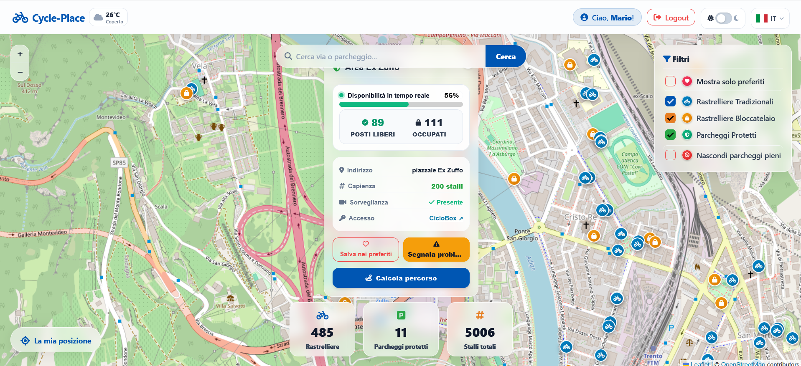
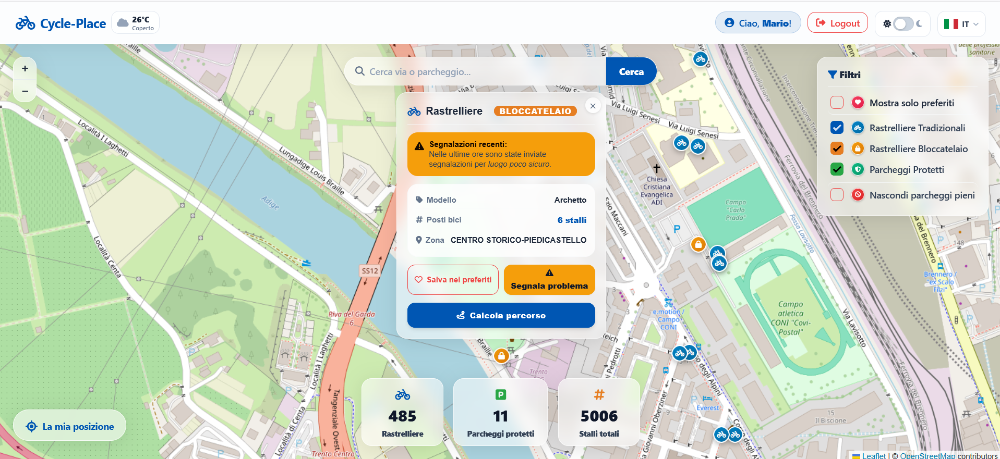
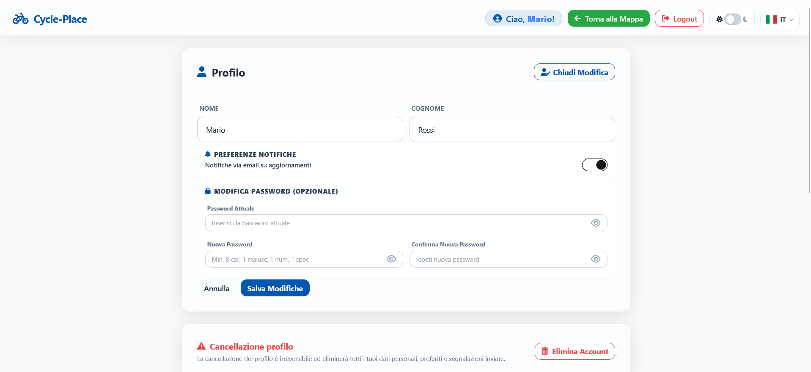

UNIVERSITÀ DEGLI STUDI DI TRENTO<br>
Dipartimento di Ingegneria e Scienza dell’Informazione

# **Progetto:** Cycle Place  
**Titolo del documento:** D2 - Sviluppo (Implementazione, Testing e Deployment)  

---

### Document Info
| Parametro | Dettaglio |
| :--- | :--- |
| **Doc. Name** | D2_Sviluppo |
| **Doc. Number** | D2 V1.6 |
| **Data Rilascio** | A.A. 2025/2026 |
| **Stato** | Rilasciato / Conforme specifiche UniTN |
| **Autori** | Edvin Helmi, Lorenzo Pasotti, Natalina Perazzolli |

---

### INDICE
- **Scopo del documento**
- **1. Web APIs**
  - *1.1 Specifica OpenAPI 3.0 (YAML)*
- **2. Implementation**
  - *2.1 Repository Organization*
  - *2.2 Branching strategy e organizzazione del lavoro*
  - *2.3 Dependencies*
  - *2.4 Database*
  - *2.5 Testing*
- **3. FrontEnd**
- **4. Deployment**
  - *4.1 Motivazione dell'Esecuzione Locale*
  - *4.2 Modalità di Esecuzione e Fruizione*
  - *4.3 Modalità di Esecuzione e Test*

---

## Scopo del documento
Il presente documento riporta in dettaglio tutte le informazioni necessarie all'implementazione ed al collaudo dell'applicazione web Cycle Place. 
In particolare, formalizza le specifiche contrattuali delle Web API conformi allo standard OpenAPI 3.0.3, l'organizzazione logica della codebase, la strategia di branching e tracciamento delle attività del team, gli schemi di modellazione dei dati persistenti, il piano formale di collaudo e testing (funzionale e di unità), l'architettura dell'interfaccia Front-End (responsive e multilingua) e, infine, la configurazione della pipeline di Continuous Integration (CI) basata su GitHub Actions per l'esecuzione automatica dei test, unitamente alle istruzioni di avvio in ambiente locale e alle credenziali di accesso per la verifica del sistema.

---

## 1. Web APIs
L'architettura del sistema di backend adotta il paradigma RESTful (Representational State Transfer) sviluppato tramite Node.js ed Express. Lo scambio informativo tra Client e Server è stateless e basato su formati standard JSON e GeoJSON. La protezione delle risorse private avviene mediante l'impiego di token crittografici **JWT (JSON Web Token)**, validati tramite apposito middleware ed inoltrati dal client all'interno dell'header HTTP `Authorization: Bearer <token>`.

Le API sono state formalizzate secondo le specifiche **OpenAPI 3.0.3**. La documentazione interattiva e la validazione dello schema OpenAPI 3.0.3 sono consultabili online tramite Swagger Editor al seguente indirizzo:<br>

https://editor.swagger.io/?url=https://raw.githubusercontent.com/edvinhelmi/Cycle-Place/main/oas3.yaml

### 1.1 Specifica OpenAPI 3.0 (YAML)
Il contenuto del file di specifica contrattuale `oas3.yaml`, depositato nella directory principale del repository, è riportato per esteso di seguito:


```yaml
openapi: 3.0.3
info:
  title: Cycle Place API
  description: Backend API per la gestione di rastrelliere, parcheggi protetti, preferiti utente, segnalazioni e routing ciclabile.
  version: 1.0.0

servers:
  - url: http://localhost:3000
    description: Server locale di sviluppo

paths:
  /api/v1/rastrelliere:
    get:
      summary: Recupera tutte le rastrelliere con telemetria smart IoT in tempo reale
      tags:
        - Dati Spaziali
      responses:
        '200':
          description: GeoJSON FeatureCollection con rastrelliere e telemetria
        '500':
          description: Errore lettura file o trasformazione coordinate

  /api/v1/parcheggi:
    get:
      summary: Recupera i parcheggi protetti per biciclette
      tags:
        - Dati Spaziali
      responses:
        '200':
          description: GeoJSON FeatureCollection dei parcheggi protetti
        '500':
          description: Errore lettura file o trasformazione coordinate

  /api/v1/config:
    get:
      summary: Restituisce le chiavi di configurazione pubblica per il frontend
      tags:
        - Configurazione
      responses:
        '200':
          description: Google Client ID per autenticazione SSO

  /api/v1/register:
    post:
      summary: Registra un nuovo account utente con password cifrata (bcrypt)
      tags:
        - Autenticazione
      requestBody:
        required: true
        content:
          application/json:
            schema:
              type: object
              required:
                - name
                - surname
                - email
                - password
              properties:
                name:
                  type: string
                  example: Mario
                surname:
                  type: string
                  example: Rossi
                email:
                  type: string
                  format: email
                  example: mario.rossi@example.com
                password:
                  type: string
                  format: password
                  example: PasswordSicura123!
      responses:
        '201':
          description: Registrazione completata con successo
        '400':
          description: Campi obbligatori mancanti o requisiti di complessità password non rispettati
        '409':
          description: Utente già registrato con questo indirizzo email
        '500':
          description: Errore interno del server durante il salvataggio

  /api/v1/login:
    post:
      summary: Autentica utente locale e rilascia Access Token (15m) e Refresh Token (30d)
      tags:
        - Autenticazione
      requestBody:
        required: true
        content:
          application/json:
            schema:
              type: object
              required:
                - email
                - password
              properties:
                email:
                  type: string
                  format: email
                password:
                  type: string
                  format: password
      responses:
        '200':
          description: Login completato con successo
        '400':
          description: Email o password mancanti o non valide
        '401':
          description: Credenziali errate
        '429':
          description: 'Troppi tentativi falliti: blocco temporaneo (Rate limit)'
        '500':
          description: Errore interno del server

  /api/v1/refresh-token:
    post:
      summary: Rinnova l'Access Token scaduto tramite Refresh Token valido
      tags:
        - Autenticazione
      requestBody:
        required: true
        content:
          application/json:
            schema:
              type: object
              required:
                - refreshToken
              properties:
                refreshToken:
                  type: string
      responses:
        '200':
          description: Nuovo Access Token generato
        '401':
          description: Token mancante
        '403':
          description: Token non valido, scaduto o sessione invalidata
        '500':
          description: Errore lettura database utenti

  /api/v1/forgot-password:
    post:
      summary: Invia email con link monouso per il reset della password
      tags:
        - Autenticazione
      requestBody:
        required: true
        content:
          application/json:
            schema:
              type: object
              required:
                - email
              properties:
                email:
                  type: string
                  format: email
                lang:
                  type: string
                  enum:
                    - it
                    - en
                    - de
                  default: it
      responses:
        '200':
          description: Email inviata con successo (o risposta anti-enumeration)
        '400':
          description: Formato email non valido o utente registrato via Google SSO
        '429':
          description: Troppi tentativi inviati (Rate limit attivo)
        '500':
          description: Errore durante la generazione o salvataggio richiesta

  /api/v1/verify-reset-token:
    get:
      summary: Verifica la validità e scadenza del token di recupero password
      tags:
        - Autenticazione
      parameters:
        - name: token
          in: query
          required: true
          schema:
            type: string
          description: Token a 64 caratteri esadecimali
      responses:
        '200':
          description: Token valido e non scaduto
        '400':
          description: Token mancante, non valido o scaduto
        '500':
          description: Errore interno del server

  /api/v1/reset-password:
    post:
      summary: Imposta una nuova password tramite il token di recupero
      tags:
        - Autenticazione
      requestBody:
        required: true
        content:
          application/json:
            schema:
              type: object
              required:
                - token
                - newPassword
              properties:
                token:
                  type: string
                newPassword:
                  type: string
                  format: password
                lang:
                  type: string
                  enum:
                    - it
                    - en
                    - de
                  default: it
      responses:
        '200':
          description: Password aggiornata con successo
        '400':
          description: Token scaduto, assente o password troppo breve
        '429':
          description: Troppi tentativi (Rate limit attivo)
        '500':
          description: Errore durante il salvataggio o hashing

  /api/v1/auth/google:
    post:
      summary: Autenticazione o registrazione con Google Identity Services (OAuth2/SSO)
      tags:
        - Autenticazione
      requestBody:
        required: true
        content:
          application/json:
            schema:
              type: object
              required:
                - credential
              properties:
                credential:
                  type: string
                  description: ID Token JWT firmato da Google
      responses:
        '200':
          description: Autenticazione completata con rilascio del token applicativo
        '400':
          description: Token Google mancante
        '401':
          description: 'Verifica fallita: token non valido o scaduto'
        '500':
          description: Configurazione Google Client ID mancante o errore salvataggio

  /api/v1/auth/verify:
    get:
      summary: Verifica la validità dell'Access Token JWT corrente
      tags:
        - Autenticazione
      security:
        - bearerAuth: []
      responses:
        '200':
          description: Token valido
        '401':
          description: Token non autorizzato, mancante o scaduto

  /api/v1/user/me:
    get:
      summary: Restituisce i dati del profilo utente autenticato
      tags:
        - Utente
      security:
        - bearerAuth: []
      responses:
        '200':
          description: Dati profilo recuperati con successo
          content:
            application/json:
              schema:
                type: object
                properties:
                  user:
                    $ref: '#/components/schemas/UserSummary'
        '401':
          description: Non autorizzato

  /api/v1/user/profile:
    put:
      summary: Aggiorna dati anagrafici, cambio password e preferenze notifiche
      tags:
        - Utente
      security:
        - bearerAuth: []
      requestBody:
        content:
          application/json:
            schema:
              type: object
              properties:
                name:
                  type: string
                surname:
                  type: string
                currentPassword:
                  type: string
                  format: password
                newPassword:
                  type: string
                  format: password
                notificheEmail:
                  type: boolean
      responses:
        '200':
          description: Profilo aggiornato e nuovo JWT rigenerato
        '400':
          description: Nuova password debole o account Google privo di password
        '401':
          description: Password attuale errata
        '404':
          description: Utente non trovato
        '500':
          description: Errore interno durante il salvataggio

  /api/v1/user/account:
    delete:
      summary: Cancellazione definitiva account e pulizia dati personali (GDPR)
      tags:
        - Utente
      security:
        - bearerAuth: []
      responses:
        '200':
          description: Account, segnalazioni e preferiti eliminati con successo
        '401':
          description: Non autorizzato
        '404':
          description: Utente non trovato
        '500':
          description: Errore durante l'eliminazione dell'account

  /api/v1/user/preferiti:
    get:
      summary: Restituisce l'elenco delle rastrelliere e parcheggi salvati come preferiti
      tags:
        - Preferiti
      security:
        - bearerAuth: []
      responses:
        '200':
          description: Lista preferiti recuperata
          content:
            application/json:
              schema:
                type: array
                items:
                  $ref: '#/components/schemas/Preferito'
        '401':
          description: Non autorizzato
    post:
      summary: Aggiunge una rastrelliera o parcheggio ai preferiti dell'utente
      tags:
        - Preferiti
      security:
        - bearerAuth: []
      requestBody:
        required: true
        content:
          application/json:
            schema:
              type: object
              required:
                - rastrellieraId
              properties:
                rastrellieraId:
                  type: integer
                tipologia:
                  type: string
                stalli:
                  type: integer
                zona:
                  type: string
                lat:
                  type: number
                lng:
                  type: number
      responses:
        '201':
          description: Elemento aggiunto ai preferiti
        '400':
          description: rastrellieraId obbligatorio
        '401':
          description: Non autorizzato
        '409':
          description: Elemento già presente nei preferiti
        '500':
          description: Errore nel salvataggio preferiti

  /api/v1/user/preferiti/{id}:
    delete:
      summary: Rimuove una rastrelliera o parcheggio dai preferiti
      tags:
        - Preferiti
      security:
        - bearerAuth: []
      parameters:
        - name: id
          in: path
          required: true
          schema:
            type: integer
          description: ID della rastrelliera o parcheggio
      responses:
        '200':
          description: Rimosso dai preferiti
        '401':
          description: Non autorizzato
        '404':
          description: Nessun preferito trovato
        '500':
          description: Errore durante la rimozione

  /api/v1/segnalazioni:
    post:
      summary: Invia una segnalazione di guasto o problema su una rastrelliera
      tags:
        - Segnalazioni
      security:
        - bearerAuth: []
      requestBody:
        required: true
        content:
          application/json:
            schema:
              type: object
              required:
                - rastrellieraId
                - tipo
              properties:
                rastrellieraId:
                  type: integer
                tipo:
                  type: string
                  example: danno_strutturale, vandalismo
                note:
                  type: string
                lat:
                  type: number
                lng:
                  type: number
      responses:
        '201':
          description: Segnalazione registrata con successo
        '400':
          description: rastrellieraId e tipo obbligatori
        '401':
          description: Non autorizzato
        '429':
          description: Troppe segnalazioni inviate (Rate limit attivo)
        '500':
          description: Errore durante il salvataggio della segnalazione

  /api/v1/segnalazioni/user:
    get:
      summary: Recupera lo storico segnalazioni inviate dall'utente autenticato
      tags:
        - Segnalazioni
      security:
        - bearerAuth: []
      responses:
        '200':
          description: Storico segnalazioni recuperato
          content:
            application/json:
              schema:
                type: array
                items:
                  $ref: '#/components/schemas/Segnalazione'
        '401':
          description: Non autorizzato

  /api/v1/segnalazioni/recenti:
    get:
      summary: Restituisce le segnalazioni aperte delle ultime 48 ore (dati personali anonimizzati)
      tags:
        - Segnalazioni
      responses:
        '200':
          description: Lista segnalazioni recenti
          content:
            application/json:
              schema:
                type: array
                items:
                  $ref: '#/components/schemas/Segnalazione'

  /api/v1/routing:
    get:
      summary: Calcola itinerario ciclabile, pedonale o in auto con OpenRouteService e failover OSRM
      tags:
        - Routing
      parameters:
        - name: startLat
          in: query
          required: true
          schema:
            type: number
          description: Latitudine di partenza
        - name: startLng
          in: query
          required: true
          schema:
            type: number
          description: Longitudine di partenza
        - name: endLat
          in: query
          required: true
          schema:
            type: number
          description: Latitudine di arrivo
        - name: endLng
          in: query
          required: true
          schema:
            type: number
          description: Longitudine di arrivo
        - name: profile
          in: query
          schema:
            type: string
            enum:
              - cycling-regular
              - foot-walking
              - driving-car
            default: cycling-regular
        - name: language
          in: query
          schema:
            type: string
            enum:
              - it
              - en
              - de
            default: it
      responses:
        '200':
          description: Tracciato GeoJSON con manovre turn-by-turn
        '400':
          description: Parametri obbligatori mancanti o coordinate non numeriche
        '504':
          description: Timeout superato per il calcolo del tragitto (oltre 4.5s)

components:
  securitySchemes:
    bearerAuth:
      type: http
      scheme: bearer
      bearerFormat: JWT
  schemas:
    UserSummary:
      type: object
      properties:
        name:
          type: string
        surname:
          type: string
        email:
          type: string
          format: email
    Preferito:
      type: object
      properties:
        id:
          type: integer
        tipologia:
          type: string
        stalli:
          type: integer
        zona:
          type: string
        lat:
          type: number
        lng:
          type: number
        savedAt:
          type: string
          format: date-time
    Segnalazione:
      type: object
      properties:
        id:
          type: string
        rastrellieraId:
          type: integer
        tipo:
          type: string
        note:
          type: string
        lat:
          type: number
        lng:
          type: number
        timestamp:
          type: string
          format: date-time
        stato:
          type: string
          example: inviata
```

---

## 2. Implementation

L'applicazione è stata sviluppata sfruttando le seguenti tecnologie primarie: Node.js ed Express per il layer di backend e persistenza, HTML5/CSS3/JavaScript ES6 per il client SPA, abbinato a Tailwind CSS, DaisyUI e Leaflet.js per la componente UI e geospaziale. La scelta dello stack è maturata dall'esigenza di massimizzare le prestazioni del rendering mappa su dispositivi mobili, evitare overhead infrastrutturali e sfruttare standard cartografici aperti.

### 2.1 Repository Organization

Il codice sorgente del progetto è archiviato nel repository ufficiale GitHub: https://github.com/edvinhelmi/Cycle-Place.git<br>

La struttura delle cartelle e dei file sorgente è così organizzata:

```text
CyclePlace/
├── data/
│   ├── parcheggi.geojson        
│   ├── rastrelliere.geojson      
│   ├── preferiti.json           
│   ├── segnalazioni.json        
│   └── users.json               
├── docs/
│   ├── design-front-end/
│   │   ├── ciclobox.png
│   │   ├── bloccatelaio.png
│   │   ├── dark_mode.png
│   │   ├── elimina_account.png
│   │   ├── form_segnalazione.png
│   │   ├── loggato.png
│   │   ├── login.png
│   │   ├── modifica_dati.png
│   │   ├── navigazione.png
│   │   ├── popup_meteo.jpeg
│   │   ├── popup_nagivazione.png
│   │   ├── profilo.png
│   │   ├── rastrelliera.png
│   │   ├── recupero_password.png
│   │   ├── registrazione.png
│   │   ├── ricerca_negativa.png
│   │   ├── ricerca_positiva.png
│   │   ├── schermata_iniziale.png
│   │   └── segnalazione.png
│   ├── powerpoint/
│   │   ├── 1.jpg
│   │   ├── 2.jpg
│   │   ├── 3.jpg
│   │   └── 4.jpg
│   ├── use-case/
│   │   ├── RF1_Diagram.drawio.png
│   │   ├── RF2_Diagram.drawio.png
│   │   ├── RF3_Diagram-drawio.png
│   │   ├── RF4.drawio.png
│   │   ├── RF5_Diagram.drawio.png
│   │   ├── RF6_Diagram.drawio.png
│   │   ├── RF7_Diagram.drawio.png
│   │   ├── RF8_Diagram.drawio.png
│   │   └── RF9_Diagram.drawio.png
│   ├── user-flow/
│   │   ├── UserFlow1.drawio.png
│   │   ├── UserFlow2.drawio.png
│   │   └── UserFlow3.drawio.png
│   ├── D1_Descrizione_Progetto.md
│   ├── D2_Sviluppo.md
│   └── D4_Report_Finale.md
├── middleware/
│   └── tokenChecker.js          
├── public/                     
│   ├── css/
│   │   ├── dashboard.css       
│   │   ├── style.css            
│   │   └── tailwind.css       
│   ├── js/
│   │   ├── dashboard.js         
│   │   ├── i18n.js             
│   │   └── script.js           
│   ├── dashboard.html          
│   └── index.html              
├── tests/
│   ├── api_responses.text.js
│   ├── oas.test.js
│   ├── auth.test.js            
│   └── api.test.js              
├── .env.example                 
├── .gitignore                   
├── app.js                      
├── oas3.yaml                   
├── package.json
├── tailwind.config.js              
└── README.md                   
```

### 2.2 Branching strategy e organizzazione del lavoro
La gestione del ciclo di vita del codice ha utilizzato un repository Git ospitato in cloud (GitHub) mediante la metodologia Agile. Nello sviluppo del progetto abbiamo collaborato attivamente in modo prevalentemente asincrono, scelta dovuta a particolari esigenze del gruppo, e ci siamo divisi il lavoro nel seguente modo: 

- Edvin ha pensato prevalentemente allo sviluppo di back-end, front-end, alla creazione dei file .json usati come database ed all'integrazione di jest per lo sviluppo dei test. Inoltre ha contribuito attivamente alla scrittura di tutti i documenti, ed in particolare alla stesura del D2. 

- Lorenzo ha gestito l'organizzazione del lavoro, la creazione delle slides di presentazione del progetto, è stato il principale autore del video di presentazione del progetto, del business model ed ha contribuito attivamente alla stesura di tutti i documenti, in particolare D3 e D4. 

- Natalina ha pensato principalmente ad integrare funzionalità utili all'applicazione, si è occupata del design-thinking, ui-ux design, ha effettuato una suite di test automatizzati ed ha contribuito attivamente alla stesura di tutti i documenti, in modo particolare il D1.

La ripartizione dei contributi e dei commit è tracciata sulla piattaforma GitHub. Le eventuali asimmetrie nel computo numerico dei commit tra i componenti derivano da differenti approcci di raggruppamento (molti commit piccoli per modifiche UI/CSS e modifiche ai documenti a fronte di commit corposi per l'infrastruttura backend e i casi di test).

Il ciclo di sviluppo del progetto è stato effettuato operando direttamente sul ramo principale (main) del repository remoto su GitHub, senza l'adozione di rami di sviluppo (branching) isolati o flussi di revisione tramite Pull Request, privilegiando un approccio di integrazione continua diretto e snello.

### 2.3 Dependencies
Il backend del progetto si basa sulle seguenti dipendenze runtime caricate tramite npm:
*   **express**: (Backend) Framework minimalista e flessibile per la creazione del Web Server e il routing logico delle chiamate.
*   **jsonwebtoken**: (Backend) Permette la serializzazione, validazione e scadenza (`exp`) dei token JWT in modo *stateless*.
*   **google-auth-library**: (Backend) Libreria crittografica ufficiale di Google impiegata per il decoding del ticket SSO del login ibrido.
*   **proj4**: (Backend) Componente di cartografia matematica fondamentale per tradurre i tensori da formato UTM a coordinate spaziali convenzionali WGS84.
*   **cors**: (Backend) Middleware strategico vitale per limitare o allentare le direttive di Cross-Origin Resource Sharing.
*   **bcrypt**: Libreria crittografica impiegata per il hashing sicuro delle password utente (`salt rounds`).
*   **express-rate-limit**: Middleware di limitazione del tasso di richieste per la protezione degli endpoint sensibili da attacchi di forza bruta e spam.
*   **Tailwind CSS**: (Frontend) Framework utility-first utilizzato per definire rapidamente stili responsivi direttamente nel markup, garantendo consistenza e una codebase CSS minima.
*   **DaisyUI**: (Frontend) Libreria di componenti per Tailwind CSS, utilizzata per lo scaffolding rapido di elementi UI (bottoni, modali, card) preservando pulizia del codice e semantica.
*   **Leaflet.js**: (Frontend) Framework cartografico client-side integrato nativamente su CDN. Consente l'innesto della View Map in HTML5, la gestione del pan/zoom dinamico, e l'overlay dei custom marker e geo-layer.
*   **nodemailer**: Modulo di gestione SMTP per l'inoltro delle comunicazioni transazionali (es. reset password utente).

E le seguenti dipendenze di sviluppo:
*   **jest**: Framework di testing JavaScript principale utilizzato per l'esecuzione, l'automazione e l'asserzione della test-suite.
*   **supertest**: Libreria di testing HTTP integrata con Jest per il collaudo end-to-end e di integrazione delle API RESTful senza la necessità di avviare manualmente il server di rete.


### 2.4 Database
A causa del ridottissimo I/O rate temporale, il progetto rifiuta il sovradimensionamento di DBMS complessi, prediligendo un approccio leggero orientato agli standard aperti. Le infrastrutture geografiche sono serializzate in formati GeoJSON caricati dal file-system su richiesta dell'Express Server. Per preservare la massima portabilità del prototipo, azzerare le latenze di runtime ed evitare l'overhead di un DBMS esterno dedicato, il sistema memorizza le entità applicative all'interno di file JSON strutturati:

- **Users** (users.json): Mantiene l'anagrafica utente, il digest della password crittografata con bcrypt, i token di sessione e recupero credenziali.

- **Preferiti** (preferiti.json): Mappatura bidirezionale indicizzata per ID utente (sub) contenente l'elenco dei punti d'interesse salvati

- **Segnalazioni** (segnalazioni.json): Registro delle anomalie territoriali comunicate dalla community con relativo stato di avanzamento..


### 2.5 Testing 
Le API e il relativo codice presentano una test-suite che consente di verificarne il corretto funzionamento. I test sono utilizzati all’interno della configurazione di CI/CD.  

L’implementazione dei test è organizzata in file .test.js raccolti all’interno della cartella dedicata tests/.  

Sebbene la tabella riportata in seguito preveda una copertura di soli 29 macro-scenari di collaudo, l'implementazione effettiva della test-suite in ambiente Jest/Supertest si articola su 46 test case distinti. Questo è dovuto alla scomposizione dei macro-requisiti in molteplici test case di unità e di integrazione mirati a verificare sistematicamente tutti i rami di errore e i relativi casi limite, quali la gestione dei campi obbligatori mancanti, la validazione delle espressioni regolari per password ed email, i controlli di unicità dei dati ecc...

Riportiamo quindi qui sotto l'esito dei test effettuati:

| Numero | Test Case | Descrizione Test Case | Test Data | Precondizioni | Dipendenze | Risultato Atteso | Risultato Riscontrato |
|:---:|---|---|---|---|---|---|:---:|
| **TC-01** | Creazione account con campi anagrafici vuoti | Verifica il rigetto della registrazione in caso di stringhe vuote. | `name: ""`, `email: "test@local.it"`, `password: "123"` | Nessuna | Endpoint `POST /api/v1/register` | Rigetto transazione con HTTP `400 Bad Request` e feedback d'errore su input. | Positivo |
| **TC-02** | Creazione account con email duplicata | Verifica il vincolo di unicità dell'indirizzo email a livello di persistenza. | `email: "test@unitn.it"`, credenziali valide | Utente già registrato nel sistema | Endpoint `POST /api/v1/register` | Il backend intercetta il duplicato, non altera i record e restituisce `409 Conflict`. | Positivo |
| **TC-03** | Creazione account con violazione policy password | Verifica che password con meno di 8 caratteri o prive di complessità vengano respinte. | `password: "123"` | Nessuna | Regex sicurezza password in `app.js` | Blocco sottomissione con HTTP `400` ed evidenziazione dei requisiti mancanti. | Positivo |
| **TC-04** | Login formale valido | Verifica che le credenziali locali autorizzino il login rilasciando i token. | `email: "test@unitn.it"`, `password: "PasswordSicura123!"` | Utente inserito nel record store `users.json` | Endpoint `POST /api/v1/login` | Risposta `200 OK` + rilascio di `accessToken` (JWT 15m) e `refreshToken` (30d). | Positivo |
| **TC-05** | Login errato (Test Negativo) | Verifica che il sistema prevenga accessi non autorizzati con password non corrispondente. | `email: "test@unitn.it"`, `password: "WrongPassword99!"` | Utente registrato nel sistema | Endpoint `POST /api/v1/login`, confronto `bcrypt` | Il backend ferma la transazione con Status `401 Unauthorized` e notifica errore. | Positivo |
| **TC-06** | Autenticazione federata tramite Google Sign-In (SSO) | Verifica la gestione del login SSO in caso di payload non valido o assente. | Payload vuoto `{}` o credential non firmata | Google Client ID configurato | Endpoint `POST /api/v1/auth/google` | HTTP `400 Bad Request` per payload mancante o `401 Unauthorized` per token scaduto. | Positivo |
| **TC-07** | Rinnovo automatico sessione tramite Refresh Token | Verifica la rigenerazione dell'Access Token scaduto tramite Refresh Token. | Payload: `{ refreshToken: "token_attivo" }` | Sessione registrata | Endpoint `POST /api/v1/refresh-token` | Rilascio di un nuovo Access Token valido per 15 min (`200 OK`) o `401/403` se revocato. | Positivo |
| **TC-08** | Richiesta link di recupero password | Generazione token monouso sicuro a 64 caratteri e notifica email. | `email: "mario.test@unitn.it"`, `lang: "it"` | Account locale registrato | Endpoint `POST /api/v1/forgot-password`, Nodemailer | Generazione token monouso a 64 caratteri, invio email di ripristino e risposta `200 OK`. | Positivo |
| **TC-09** | Impostazione nuova password con token valido | Verifica aggiornamento password tramite token di reset ricevuto. | `token: "<token_esadecimale>"`, `newPassword: "Nuova!2026"` | Token di reset valido (< 1 ora) | Endpoint `POST /api/v1/reset-password` | Aggiornamento hash bcrypt su `users.json`, invalidazione token usato e risposta `200 OK`. | Positivo |
| **TC-10** | Modifica dati anagrafici e cambio password da Dashboard | Verifica modifica profilo con validazione della password attuale. | Payload con nuovo nome, password attuale e nuova password | Utente autenticato con Bearer Token | Endpoint `PUT /api/v1/user/profile`, middleware auth | Verifica password corrente, re-hashing nuova password, emissione JWT e risposta `200 OK`. | Positivo |
| **TC-11** | Cancellazione definitiva account utente (Diritto all'Oblio GDPR) | Rimozione fisica record utente e bonifica a cascata di preferiti e segnalazioni. | Richiesta autenticata con Bearer Token | Utente autenticato con dati attivi | Endpoint `DELETE /api/v1/user/account` | Rimozione fisica dell'utente e bonifica a cascata di preferiti e segnalazioni (`200 OK`). | Positivo |
| **TC-12** | Filtraggio dinamico layer cartografici (UI) | Verifica disattivazione e ricalcolo parziale della mappa per stalli tradizionali. | Switch: Checkbox disattivata (`false`) | Mappa Leaflet esposta con marker caricati | Servizio Leaflet / LayerGroup | I marker tradizionali spariscono istantaneamente dall'overlay senza ricaricare la pagina. | Positivo |
| **TC-13** | Autolocalizzazione GPS utente (UI) | Verifica la funzionalità del pulsante floating di geolocalizzazione sulla mappa. | Click su bottone "🎯" (Consensi attivi) | Browser HTML5 Geolocation API | Hardware GPS / Browser | La viewport esegue un pan morbido centrando le coordinate GPS correnti. | Positivo |
| **TC-14** | Protezione invio segnalazioni da utenti anonimi | Verifica che solo gli utenti autenticati possano inoltrare segnalazioni di guasto. | Sottomissione payload segnalazione senza Bearer token | Utente non autenticato | Endpoint `POST /api/v1/segnalazioni`, middleware | Blocco immediato con HTTP `401 Unauthorized` e protezione integrità community. | Positivo |
| **TC-15** | Ricerca toponomastica spaziale (UI) | Verifica l'immissione testuale e spostamento vettoriale della bounding-box. | Input Testo: "Via Roma, Trento" | Marker serializzati nel layer | OpenStreetMap Nominatim API | Risoluzione toponimo e posizionamento automatico della mappa sull'indirizzo. | Positivo |
| **TC-16** | Protezione endpoint contro attacchi di forza bruta (Rate Limiter) | Intercettazione delle richieste eccedenti con blocco temporaneo. | Più di 10 tentativi consecutivi di login in < 15 min | Nessuna | Middleware `express-rate-limit` | Blocco temporaneo con codice HTTP `429 Too Many Requests`. | Positivo |
| **TC-17** | Aggiunta e persistenza preferito | Salvataggio di una rastrelliera nell'elenco preferiti dell'utente autenticato. | `rastrellieraId: 142`, `tipologia: "Bloccatelaio"` | Utente autenticato con JWT | Endpoint `POST /api/v1/user/preferiti` | HTTP `201 Created`, memorizzazione su `preferiti.json` e aggiornamento stato visivo. | Positivo |
| **TC-18** | Rimozione rastrelliera preferita | Cancellazione del preferito dall'area profilo e disattivazione stato su mappa. | ID rastrelliera target: `142` | Preferito presente nella lista | Endpoint `DELETE /api/v1/user/preferiti/:id` | Risposta `200 OK`, rimozione del record dal file JSON e aggiornamento vista. | Positivo |
| **TC-19** | Recupero configurazione pubblica client | Esposizione controllata delle credenziali client-side non sensibili. | Richiesta `GET` senza parametri | Variabile ambiente Google presente | Endpoint `GET /api/v1/config` | HTTP `200 OK` con JSON `{ googleClientId: "..." }`. | Positivo |
| **TC-20** | Recupero dataset rastrelliere smart IoT | Erogazione FeatureCollection GeoJSON completa di telemetria stalli. | Richiesta `GET` su dataset stalli | File GeoJSON disponibile | Endpoint `GET /api/v1/rastrelliere` | HTTP `200 OK` con GeoJSON valido contenente occupazione in tempo reale. | Positivo |
| **TC-21** | Recupero dataset parcheggi protetti | Erogazione layer GeoJSON dedicato ai ricoveri protetti per biciclette. | Richiesta `GET` senza parametri | File GeoJSON parcheggi disponibile | Endpoint `GET /api/v1/parcheggi` | HTTP `200 OK` con FeatureCollection dei parcheggi protetti. | Positivo |
| **TC-22** | Verifica validità Access Token JWT attivo | Verifica integrità sessione e validità della firma crittografica. | Header `Authorization: Bearer <jwt_valido>` | Token attivo e non scaduto | Endpoint `GET /api/v1/auth/verify` | HTTP `200 OK` con `{ valid: true }` (o `401` se assente/compromesso). | Positivo |
| **TC-23** | Recupero anagrafica profilo utente autenticato | Restituzione delle informazioni dell'utente con sessione attiva. | Header `Authorization: Bearer <jwt_valido>` | Utente autenticato | Endpoint `GET /api/v1/user/me` | HTTP `200 OK` con oggetto utente contenente `name`, `surname`, `email`. | Positivo |
| **TC-24** | Lettura lista preferiti salvati dall'utente | Restituzione dell'elenco completo dei preferiti associati all'account. | Header `Authorization: Bearer <jwt_valido>` | Utente autenticato | Endpoint `GET /api/v1/user/preferiti` | HTTP `200 OK` con array dei preferiti caricato da `preferiti.json`. | Positivo |
| **TC-25** | Invio segnalazione guasto da utente autenticato | Archiviazione di una nuova anomalia/guasto su una rastrelliera. | `rastrellieraId: 15`, `tipo: "danno_strutturale"` | Utente autenticato | Endpoint `POST /api/v1/segnalazioni` | HTTP `201 Created` con salvataggio nel database e rilascio ID segnalazione. | Positivo |
| **TC-26** | Consultazione storico personale segnalazioni | Recupero dello storico guasti inviati esclusivamente dal richiedente. | Header `Authorization: Bearer <jwt_valido>` | Utente autenticato | Endpoint `GET /api/v1/segnalazioni/user` | HTTP `200 OK` con lista segnalazioni filtrate per l'utente loggato. | Positivo |
| **TC-27** | Consultazione segnalazioni pubbliche recenti (ultime 48h) | Esposizione dei problemi attivi sul territorio con anonimizzazione GDPR. | Richiesta `GET` pubblica senza token | Segnalazioni registrate | Endpoint `GET /api/v1/segnalazioni/recenti` | HTTP `200 OK` con ticket delle ultime 48h privi di dati anagrafici dei segnalatori. | Positivo |
| **TC-28** | Validazione input calcolo itinerario ciclabile (Routing) | Rilevamento e blocco di coordinate mancanti o malformate. | Coordinate nulle o `startLat: "non_valido"` | Nessuna | Endpoint `GET /api/v1/routing` | HTTP `400 Bad Request` con dettaglio sui parametri mancanti/errati. | Positivo |
| **TC-29** | Timeout e failover resiliente servizio di Routing | Resilienza con failover OSRM o gestione controllata timeout 4.5s. | Query valida: coordinate `start`/`end` | OpenRouteService / OSRM | Endpoint `GET /api/v1/routing` | HTTP `200 OK` con tracciato turn-by-turn oppure `504 Gateway Timeout`. | Positivo |

---

## 3. FrontEnd

L'interfaccia utente è stata concepita come una Single Page Application (SPA) reattiva, orientata ai principi del design Mobile-First e all'alta leggibilità delle informazioni cartografiche. La logica dell'interfaccia, organizzata all'interno del file public/js/script.js, implementa un'architettura MVC (Model-View-Controller) client-side:

- Model: I dati GeoJSON delle rastrelliere e dei parcheggi, uniti allo stato in memoria della sessione, dei preferiti e delle coordinate dell'utente.
- View: La composizione del DOM HTML5, integrata con il layer grafico responsive fornito da Tailwind CSS, i componenti di DaisyUI e i contenitori mappa generati dinamicamente da Leaflet.js.
- Controller: La gestione degli Event Listener (click, submit, touch events), l'orchestrazione delle chiamate asincrone (fetch), la manipolazione delle modali e la geolocalizzazione turn-by-turn.

Il Front-End fornisce le funzionalità di visualizzazione interattiva, gestione spaziale, navigazione e controllo dei dati dell’applicazione, articolandosi nelle seguenti sezioni e componenti descritte nel documento di progetto e specificate nel D1:

* **Home Page e Mappa Interattiva**: L'interfaccia principale integra una vista cartografica basata su Leaflet.js e OpenStreetMap per la visualizzazione delle rastrelliere tradizionali, dei bloccatelaio e dei parcheggi protetti (Ciclobox). La schermata comprende:
  * Una **barra di ricerca spaziale** con geocoding e un sistema di filtraggio automatico nel raggio di 200 metri nel caso in cui non vengano rilevati parcheggi nella via specificata.
  * Un **widget meteo live** (integrato con l'API Open-Meteo) dotato di banner di allerta automatici in-app in caso di eventi atmosferici avversi.
  * Un **selettore di lingua** dinamico per la fruizione in Italiano, Inglese e Tedesco e un **interruttore per il tema chiaro/scuro** (Dark Mode) con persistenza nel `localStorage` del browser.
  * Un pannello filtri laterale (accessibile via drawer responsive con menu hamburger su mobile) per la gestione delle tipologie di sosta e dei preferiti.

<p align="center">
<br>
<em>Schermata principale</em>
</p>

<p align="center">
<br>
<em>Nessuna rastrelliera trovata nella via specificata, né nei 200m circostanti</em>
</p>

<p align="center">
<br>
<em>Ricerca effettuata con successo</em>
</p>

<p align="center">
<br>
<em>Popup meteo</em>
</p>

* **Modale di Autenticazione (Login & Registrazione)**: Accessibile tramite un'apposita schermata centrata (attivabili cliccando rispettivamente si pulsanti "Registrati" e "Login" nella navbar) che si apre sopra la mappa, offre:
 **Modale di Login**: Una schermata centrata che si apre sopra la mappa, offrendo la doppia modalità di accesso tramite credenziali locali (email e password validate con hashing bcrypt) o tramite il pulsante rapido **Google SSO** (OAuth 2.0), oltre al link per il **recupero password** via email.
 **Modale di Registrazione**: Una schermata dedicata per la creazione di un nuovo account che richiede i dati anagrafici e verifica il rispetto dei criteri di complessità della password (minimo 8 caratteri, una maiuscola, un numero e un carattere speciale).

<p align="center">
<br>
<em>Pupup registrazione</em>
</p>

<p align="center">
<br>
<em>Popup login</em>
</p>

<p align="center">
<br>
<em>Recupero password</em>
</p>

<p align="center">
<br>
<em>Schermata visibile dopo aver effettuato il login</em>
</p>

* **Navigazione Turn-by-Turn in-app (Routing)**: Modulo attivabile selezionando una destinazione sulla mappa:
  * Sfrutta l'integrazione con l'API di **OpenRouteService** per il calcolo dei percorsi ciclabili o pedonali.
  * Integra un banner superiore con indicazioni di marcia, distanze e la **Web Speech API (TTS)** per la riproduzione vocale automatica delle istruzioni di guida multilingua, unitamente ai controlli per recentrare la mappa o terminare la sessione.

<p align="center">
<br>
<em>Popup navigazione</em>
</p>

<p align="center">
<br>
<em>Navigazione</em>
</p>

* **Popup Interattivi delle Aree di Sosta**: Attivabili cliccando sui marker della mappa in stile Glassmorphism:
  * Mostrano i metadati completi dello stallo e, nel caso dei Ciclobox, la **telemetria IoT in tempo reale** con una progress bar dinamica e il conteggio esatto dei posti liberi e occupati.
  * Integrano l'icona a forma di cuore per la gestione rapida dei **preferiti** e il modulo d'accesso per l'**invio di segnalazioni** di guasti o problemi di sicurezza, oltre alla visualizzazione di avvisi in evidenza in presenza di segnalazioni recenti.

<p align="center">
<br>
<em>Rastrelliera</em>
</p>

<p align="center">
<br>
<em>Ciclobox</em>
</p>

<p align="center">
<br>
<em>Ciclobox con segnalazione effettuata nelle ore precedenti</em>
</p>

<p align="center">
<br>
<em>Form segnalazione</em>
</p>

* **Dashboard Personale (Area Riservata)**: Pannello di controllo protetto e dedicato agli utenti autenticati per:
  * La visualizzazione e modifica dei dati anagrafici e della password.
  * La consultazione e la rimozione rapida delle rastrelliere salvate nei **preferiti** (con sincronizzazione real-time sul database e aggiornamento dei marker).
  * La gestione dello **storico delle segnalazioni** inviate con evidenza dello stato di lavorazione e l'esecuzione della procedura di **cancellazione definitiva dell'account** in conformità con le normative GDPR.

<p align="center">
<br>
<em>Profilo</em>
</p>

<p align="center">
<br>
<em>Modifica dei dati anagrafici e della password</em>
</p>

<p align="center">
<br>
<em>Eliminazione account</em>
</p>

---

## 4. Deployment 

L'architettura del backend e del frontend di Cycle-Place è concepita per l'esecuzione in ambiente locale di sviluppo, garantendo il pieno controllo sui file di persistenza JSON e l'isolamento dei test.

### Motivazione dell'Esecuzione Locale 
Si è scelto deliberatamente di **non effettuare il deployment del backend su piattaforme di cloud hosting terze** (quali Render, Railway o simili) per ragioni di sicurezza, privacy e natura dei dati gestiti:
- **Persistenza su File System**: Il backend utilizza file JSON locali per la memorizzazione persistente degli utenti, dei preferiti e delle segnalazioni. L'hosting su server cloud stateless o "serverless" comporterebbe la perdita o la volatilità dei dati a ogni riavvio o ridistribuzione dei container (a meno di configurare volumi di storage persistenti esterni).
- **Protezione dei Dati Sensibili**: L'assenza di un database remoto gestito da terzi previene l'esposizione accidentale o non autorizzata dei dati personali degli utenti in chiaro sul cloud pubblico, garantendo un controllo rigoroso sul perimetro di esecuzione locale.

### Modalità di Esecuzione e Fruizione
Per la consultazione e la verifica del sistema da parte dei valutatori, il progetto adotta un approccio duplice:
1. **Ambiente Backend**: L'applicazione server è concepita per l'esecuzione in ambiente locale di sviluppo, corredata da script di avvio automatizzati e validata integralmente tramite una test-suite dedicata.
2. **Documentazione e Interfaccia API (Static Deployment)**: La documentazione formale delle specifiche tecniche e del contratto di interfaccia (OpenAPI 3.0.3) è stata resa accessibile pubblicamente e in modalità statica tramite GitHub Pages, consentendo la consultazione interattiva immediata della struttura delle API senza la necessità di mantenere attivo un server backend in produzione.

Per completezza riportiamo qui la modalità di avvio dell'applicazione: 

**1. Clonare il repository e posizionarsi nella cartella di lavoro:**<br>
git clone https://github.com/edvinhelmi/Cycle-Place.git<br>
cd Cycle-Place

**2. Installare le dipendenze di Node.js:**<br>
npm install

**3. Avviare il server backend:**<br>
npm start

### Modalità di Esecuzione e Test

Il sistema non prevede un deploy permanente su piattaforme cloud esterne, per cui una volta clonato il repository ed installate le dipendenze di node.js è sufficiente eseguire i test (per la verifica automatica dei 46 test case tramite Jest e Supertest) attraverso il seguente comando:

**Esecuzione Test Suite:**<br>
npm test
